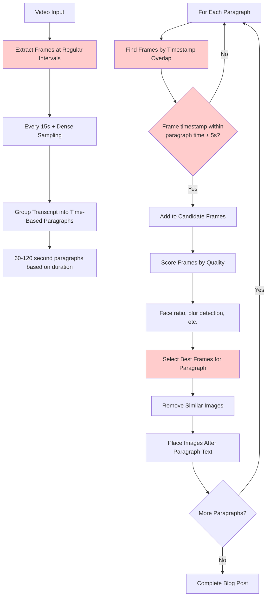
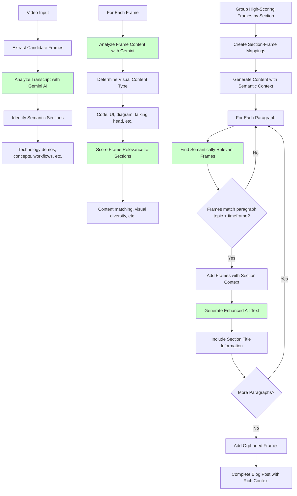

# Frame Selection Algorithm Comparison

## Old Temporal Frame Selection Algorithm



### Characteristics:
- **Time-driven**: Frames selected purely by timestamp overlap
- **Paragraph boundaries**: Fixed 60-120 second chunks regardless of content
- **Content-blind**: No analysis of what's being discussed
- **Predictable placement**: Even distribution across timeline
- **Fast processing**: No AI analysis required

---

## New Semantic Frame Selection Algorithm



### Characteristics:
- **Content-aware**: AI analyzes both transcript and visual content
- **Intelligent matching**: Frames selected based on topic relevance
- **Flexible sections**: Content grouped by semantic meaning
- **Rich context**: Section titles and detailed descriptions
- **Enhanced quality**: Better content-to-visual alignment

---

## Key Algorithmic Differences

| Aspect | Temporal Algorithm | Semantic Algorithm |
|--------|-------------------|-------------------|
| **Frame Selection** | Time-based overlap | Content relevance scoring |
| **Paragraph Grouping** | Fixed duration (60-120s) | Topic-based sections |
| **Content Analysis** | None | Gemini AI analysis |
| **Frame Scoring** | Visual quality only | Content relevance + quality |
| **Placement Logic** | Timestamp proximity | Semantic matching |
| **Context Information** | Minimal alt text | Rich section context |
| **Processing Speed** | Fast | Slower (AI analysis) |
| **Content Quality** | Hit-or-miss | Highly relevant |

---

## Frame Placement Comparison

### Temporal Approach:
```
Paragraph 1 (0-60s): "Welcome to this tutorial..."
→ Frame at 45s (whatever was on screen)

Paragraph 2 (60-120s): "First, let's configure the settings..."
→ Frame at 95s (might show unrelated content)

Paragraph 3 (120-180s): "Now we'll implement the function..."
→ Frame at 150s (could be showing previous step)
```

### Semantic Approach:
```
Paragraph 1: "Welcome to this tutorial..."
→ No frames (introduction, no visual content needed)

Paragraph 2: "First, let's configure the settings..."
→ Frame from "Configuration" section (shows actual settings screen)

Paragraph 3: "Now we'll implement the function..."
→ Frame from "Code Implementation" section (shows relevant code)
```

The semantic approach ensures that frames actually illustrate the concepts being discussed, rather than just happening to occur at the same time.